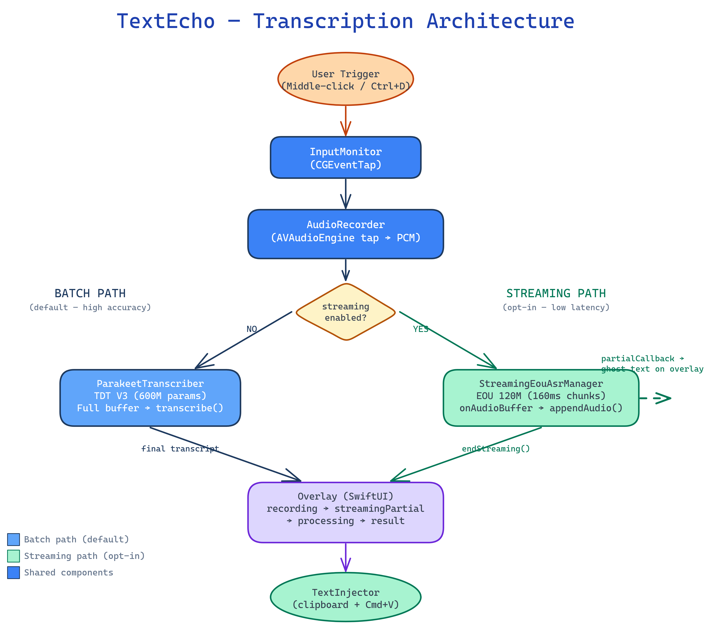

# TextEcho

Voice-to-text dictation for macOS with native on-device transcription on Apple Silicon. Hold a button, speak, release — your words appear as text. No cloud, no Python, fully offline after first model download.

**Default engine: Parakeet TDT v3** (2.1% WER, 3-6x faster than Whisper) via FluidAudio SDK. WhisperKit available as fallback. Choose your engine in Setup Wizard or Settings.

**Streaming (Beta):** Enable real-time partial transcription — text appears live as you speak, powered by FluidAudio's EOU 120M model. Enable in Settings → Streaming (Beta).

**Author:** Braxton Bragg
**Contributor:** [Lochie](https://github.com/MachinationsContinued) — UI rework, settings redesign, model management, activation modes, transcription history

```
┌─────────────────────────────────────────────────────┐
│ ╔══════════════════════════════════════════════════╗ │
│ ║  ● RECORDING              TEXT ECHO             ║ │
│ ║                                                  ║ │
│ ║  ▐█▌▐██▌▐█▌▐▌▐██▌▐███▌▐█▌▐██▌▐█▌▐▌▐██▌▐███▌  ║ │
│ ║                                                  ║ │
│ ║          WHISPER // LARGE V3 TURBO               ║ │
│ ╚══════════════════════════════════════════════════╝ │
│                                                     │
│  Pink recording → Purple processing → Green result  │
│  Cyberpunk overlay follows your cursor              │
└─────────────────────────────────────────────────────┘
```

## Features

- **Dual transcription engines** — Parakeet TDT v3 (default, 2.1% WER) or WhisperKit, both via Apple Neural Engine (Core ML)
- **Real-time streaming (Beta)** — opt-in live transcription via EOU 120M model; partial text appears in overlay as you speak
- **Whispers heard** — pre-model silence gate removed; quiet and whispered speech now reaches the transcription model
- **Push-to-talk** — middle-click, Ctrl+D, or Stream Deck Pedal
- **Theme presets** — 5 built-in themes (TextEcho, Cyber, Classic, Ocean, Sunset) + custom color picker + saveable user presets
- **Cyberpunk overlay** — pink→purple→neon green states, waveform visualization, ghost text during streaming
- **Stream Deck Pedal** — center=dictate, left=paste, right=enter (auto-detect, no Elgato software)
- **Instant paste** — transcribed text goes straight to your cursor via clipboard
- **Fully offline** — no cloud, no accounts, audio never leaves your Mac
- **Fast model loading** — lazy load on first use, auto-unload after idle
- **Menu bar app** — settings, help, log viewer, setup wizard
- **Native LLM** — on-device MLX processing with 6 models and 3 modes (Grammar Fix, Rephrase, Answer). Shift+Middle-click to transcribe+process. Pre-send review with Enter/ESC, mode cycling with Ctrl+Shift+M, ESC to cancel generation mid-stream.

## Requirements

- macOS 14+ (Apple Silicon)
- Microphone + Accessibility permissions
- Internet for first model download (~1.6GB)

## Install from DMG

Download the latest signed DMG from [GitHub Releases](https://github.com/braxcat/dictation-mac/releases). The app is Developer ID signed and Apple-notarized — no Gatekeeper warnings, no right-click workarounds.

1. **Open the DMG** — double-click `TextEcho.dmg`
2. **Drag TextEcho to Applications** — standard drag-and-drop install
3. **Launch TextEcho** — opens normally (signed + notarized)
4. **Grant permissions** when prompted:
   - **Accessibility** — System Settings → Privacy & Security → Accessibility → enable TextEcho
   - **Microphone** — System Settings → Privacy & Security → Microphone → enable TextEcho
5. **Setup Wizard** — on first launch, the wizard walks you through engine selection (Parakeet recommended), model download, activation method, theme, and silence timeout.
6. **Optional — Streaming Beta** — go to Settings → Streaming (Beta), download the EOU 120M model, and enable the toggle to get live partial transcription while speaking.
7. **Optional — Native LLM** — go to Settings → LLM, enable and choose from 6 on-device MLX models. Use Shift+Middle-click (or Ctrl+Shift+D) to transcribe and process with the LLM in one action.

**Verify the signature:**

```bash
# Check code signature
codesign -dv --verbose=2 /Applications/TextEcho.app

# Verify notarization
spctl -a -vv /Applications/TextEcho.app
# Expected: "source=Notarized Developer ID"
```

> **Unsigned dev builds:** If you build from source without `--sign`, you'll need to right-click → Open on first launch and may need `xattr -cr /Applications/TextEcho.app`.

## Quick Start (build from source)

```bash
# Build
./build_native_app.sh

# Deploy + launch
./rebuild.sh
```

Or step by step:

```bash
./build_native_app.sh
cp -R dist/TextEcho.app /Applications/
open /Applications/TextEcho.app
```

Grant **Accessibility** and **Microphone** in System Settings when prompted. First launch downloads the transcription model.

## Scripts

| Script                             | What it does                                                                          |
| ---------------------------------- | ------------------------------------------------------------------------------------- |
| `./install_dev.sh`                 | **Dev workflow**: debug build → kill → deploy → reset Accessibility → relaunch        |
| `./reset_accessibility.sh`         | Reset Accessibility permission after a rebuild (run standalone or via install_dev.sh) |
| `./rebuild.sh`                     | Pull + release build + deploy + launch (one command)                                  |
| `./rebuild.sh --clean`             | Full clean rebuild                                                                    |
| `./rebuild.sh --uninstall`         | Wipe everything, then rebuild fresh                                                   |
| `./uninstall.sh`                   | Remove app, config, models, logs, everything                                          |
| `./clean_test.sh --force --debug`  | Remove config, models, logs, MLX cache for clean first-launch testing                 |
| `./build_native_app.sh`            | Release build only (no deploy)                                                        |
| `./build_native_app.sh --debug`    | Debug build only (faster, no deploy)                                                  |
| `./build_native_app.sh --sign`     | Build with Developer ID signing + notarization                                        |
| `./build_native_app.sh --with-llm` | Build with bundled Python LLM (legacy — MLX is built-in)                              |

## Usage

### Activation Methods

Enable one or more in Settings or Setup Wizard:

| Method                | Modes         | How                                                     |
| --------------------- | ------------- | ------------------------------------------------------- |
| **Caps Lock**         | Toggle        | Press to start, press again to stop                     |
| **Mouse button**      | Toggle / Hold | Click to toggle or hold to record (configurable button) |
| **Keyboard shortcut** | Toggle / Hold | Default: Ctrl+Opt+Z (configurable key + modifiers)      |
| **Stream Deck Pedal** | Hold          | Center pedal = push-to-talk                             |

### Other Controls

| Action                    | How                                             |
| ------------------------- | ----------------------------------------------- |
| **LLM prompt (mouse)**    | Shift + Middle-click (transcribe + LLM process) |
| **LLM prompt (keyboard)** | Ctrl+Shift+D                                    |
| **Cycle LLM mode**        | Ctrl+Shift+M (Grammar Fix → Rephrase → Answer)  |
| **Paste (pedal)**         | Left pedal                                      |
| **Enter (pedal)**         | Right pedal                                     |
| **Save to register**      | Cmd+Option+1-9                                  |
| **Clear registers**       | Cmd+Option+0                                    |
| **Settings**              | Cmd+Option+Space                                |
| **Cancel**                | ESC                                             |

### LLM Review Workflow

1. **Trigger** — Shift+Middle-click (or Ctrl+Shift+D) to record with LLM
2. **Pre-send review** — after transcription, the overlay shows your text and current LLM mode. Press **Enter** to send, **Ctrl+Shift+M** to cycle modes, or **ESC** to cancel.
3. **Processing** — overlay shows "THINKING..." (purple) → "RESPONDING" (green) as tokens stream in, with auto-scroll
4. **Post-review** — press **Enter** to paste the LLM response, or **ESC** to discard
5. **Cancel anytime** — press **ESC** during LLM generation to stop immediately

The overlay dynamically resizes (560px wide for LLM content, up to 300px tall with auto-scroll).

### Transcription History

Transcriptions are saved automatically (enable in Settings). Access recent transcriptions from the menu bar for quick re-copy, or open the History window for the full list. Configure max entries (10-1000) in Settings.

## Architecture



```
                    ┌──────────────────────────────────────────┐
                    │          TextEcho.app (Swift)             │
                    │                                          │
  Hotkey/Mouse/     │  AppMain → AppState (orchestrator)       │
  Pedal input  ───► │      │         │          │              │
                    │  InputMonitor  │    StreamDeck            │
                    │  (CGEventTap)  │    PedalMonitor          │
                    │                │    (IOKit HID)           │
                    │         AudioRecorder                     │
                    │         (AVAudioEngine)                   │
                    │                │                          │
                    │       ┌────────┴────────┐                 │
                    │       │                 │                 │
                    │  streaming=false   streaming=true         │
                    │  (default)         (opt-in)               │
                    │       │                 │                 │
                    │  Transcriber      StreamingTranscriber    │
                    │  ┌──────────────┐  ┌────────────────────┐ │
                    │  │ Parakeet TDT │  │ StreamingEouAsrMgr │ │
                    │  │ V3 (default) │  │ EOU 120M model     │ │
                    │  ├──────────────┤  │ 160ms chunks       │ │
                    │  │ WhisperKit   │  │ partial callbacks  │ │
                    │  │ (fallback)   │  └────────────────────┘ │
                    │  └──────────────┘        │                │
                    │       │            .streamingPartial       │
                    │       └────────┬────────┘                 │
                    │                ▼                          │
                    │         TextInjector                      │
  Text pasted  ◄─── │    (clipboard + Cmd+V paste)             │
  into app          │                                          │
                    │         Overlay (SwiftUI)                 │
                    │    ┌──────────────────────────┐          │
                    │    │ ● RECORDING   TEXTECHO   │          │
                    │    │ partial text... (ghost)  │  ← stream │
                    │    │ ▐█▌▐██▌▐█▌▐▌▐██▌▐███▌   │          │
                    │    └──────────────────────────┘          │
                    │                                          │
                    │    MLXLLMProcessor (native MLX LLM)       │
                    │    (6 models, 4 modes, built-in)          │
                    └──────────────────────────────────────────┘
```

### Data Flow

**Batch mode (default):**

1. **Input** — CGEventTap (keyboard/mouse) or IOKit HID (pedal) triggers recording
2. **Capture** — AVAudioEngine records PCM Int16 audio
3. **Release** — full audio buffer sent to Parakeet TDT V3 (or WhisperKit fallback) on Neural Engine
4. **Filter** — hallucination filter (17 known phrases + repeat detection)
5. **Paste** — TextInjector writes to clipboard, sends Cmd+V to active app
6. **Display** — pink recording → purple processing → neon green result

**Streaming mode (opt-in, Settings → Streaming Beta):**

1. **Input** — same activation methods
2. **Capture** — `onAudioBuffer` fires every 160ms during recording
3. **Partial** — EOU 120M model processes each chunk; ghost text appears live in overlay (`.streamingPartial` state)
4. **Release** — EOU finalises transcript
5. **Paste** — TextInjector pastes final result
6. **Display** — pink recording with live ghost text → neon green result

### Key Design Decisions

| Decision         | Choice                              | Why                                                              |
| ---------------- | ----------------------------------- | ---------------------------------------------------------------- |
| Batch engine     | Parakeet TDT (default) / WhisperKit | Neural Engine, no Python; Parakeet: 2.1% WER, 3-6x faster        |
| Streaming engine | FluidAudio EOU 120M                 | Lightweight, low-latency; tuned for end-of-utterance detection   |
| Mode selection   | Either/or, not simultaneous         | Avoids Neural Engine contention; simpler model lifecycle         |
| Silence gate     | Removed from pre-model path         | RMS filter discarded quiet speech; model handles it natively     |
| Concurrency      | Swift actor                         | No shared mutable state, no data races                           |
| Audio start      | DispatchQueue.main.async            | IOKit HID callbacks block AVAudioEngine if started synchronously |
| Text injection   | Clipboard + Cmd+V                   | Most reliable cross-app method on macOS                          |
| LLM              | Native MLX (Swift)                  | On-device, 6 models, 4 modes, no Python needed                   |
| Pedal            | IOKit HID (shared mode)             | No kernel extension, no Elgato software needed                   |

## Transcription Engines & Models

### Parakeet TDT (Default)

| Model                         | WER  | Params | Languages   | Speed                    |
| ----------------------------- | ---- | ------ | ----------- | ------------------------ |
| **Parakeet TDT v3** (default) | 2.1% | 600M   | 25 European | 3-6x faster than Whisper |
| Parakeet TDT v2               | ~3%  | 600M   | English     | Fast                     |

Parakeet runs via FluidAudio SDK on Apple Neural Engine (Core ML). Model weights are CC-BY-4.0 licensed.

### WhisperKit (Fallback)

| Model              | Download | RAM    | Speed     | Quality               |
| ------------------ | -------- | ------ | --------- | --------------------- |
| **Large V3 Turbo** | ~1.6GB   | ~1.6GB | Fast      | Near-best (7.8% WER)  |
| Large V3           | ~3GB     | ~3.5GB | Slower    | Best                  |
| Base (English)     | ~140MB   | ~180MB | Very fast | Good for clear speech |

Models download on first use and cache locally. Select engine and model in Setup Wizard or Settings.

## Configuration

`~/.textecho_config` (JSON):

| Option                 | Default                                    | Description                                            |
| ---------------------- | ------------------------------------------ | ------------------------------------------------------ |
| `trigger_button`       | `2`                                        | Mouse button (0=left, 1=right, 2=middle)               |
| `dictation_keycode`    | `2`                                        | Keyboard trigger (2=D key)                             |
| `silence_duration`     | `2.5`                                      | Seconds of silence before auto-stop                    |
| `silence_threshold`    | `0.015`                                    | Audio level for silence detection                      |
| `transcription_engine` | `parakeet`                                 | Engine: `parakeet` or `whisper`                        |
| `parakeet_model`       | `parakeet-tdt-v3`                          | Parakeet model: `parakeet-tdt-v3` or `parakeet-tdt-v2` |
| `whisper_model`        | `openai_whisper-large-v3_turbo`            | WhisperKit model name                                  |
| `whisper_idle_timeout` | `0`                                        | Seconds before model unloads from RAM (0=never)        |
| `caps_lock_enabled`    | `false`                                    | Enable Caps Lock activation                            |
| `mouse_mode`           | `1`                                        | Mouse mode: 0=toggle, 1=hold                           |
| `keyboard_mode`        | `0`                                        | Keyboard mode: 0=toggle, 1=hold                        |
| `history_enabled`      | `true`                                     | Save transcription history                             |
| `pedal_enabled`        | `false`                                    | Enable Stream Deck Pedal                               |
| `pedal_position`       | `1`                                        | Push-to-talk pedal (0=left, 1=center, 2=right)         |
| `llm_enabled`          | `false`                                    | Enable LLM processing (built-in, enable in Settings)   |
| `llm_model`            | `mlx-community/Llama-3.2-3B-Instruct-4bit` | MLX LLM model (HuggingFace repo ID)                    |
| `llm_mode`             | `clean`                                    | LLM mode: `clean`, `fix`, `expand`, `custom`           |
| `llm_custom_prompt`    | `""`                                       | Custom system prompt for `custom` mode                 |
| `streaming_enabled`    | `false`                                    | Enable streaming transcription (Beta, EOU 120M model)  |

## Stream Deck Pedal

Elgato Stream Deck Pedal works out of the box via IOKit HID — no Elgato software needed (actually, quit it first).

| Pedal  | Action                        |
| ------ | ----------------------------- |
| Left   | Paste (Cmd+V)                 |
| Center | Push-to-talk (hold to record) |
| Right  | Enter                         |

Enable in Settings or `~/.textecho_config`. Auto-detects with exponential backoff (3s to 60s), auto-reconnects on unplug/replug.

## Security

- **Fully local** — no network calls after model download, no telemetry, no cloud
- **Signed & notarized** — Developer ID code signing with hardened runtime, Apple notarization
- **Sigstore attestation** — build provenance verification on GitHub Releases
- **Swift CI** — automated `swift test` + `swift build` on every PR to main
- **Release CI** — GitHub Actions workflow builds, signs, notarizes, and publishes on version tags
- **CodeQL scanning** — automated SAST on PRs (Swift injection, path traversal, data races)
- **Dependabot** — weekly dependency vulnerability checks (SwiftPM + GitHub Actions)
- **File permissions** — transcription history written with 0600 (owner-only) permissions
- **Atomic writes** — config and history files use atomic writes to prevent corruption
- **Input sanitization** — model names validated against path traversal before filesystem operations

## Troubleshooting

| Problem                        | Fix                                                                         |
| ------------------------------ | --------------------------------------------------------------------------- |
| No transcription               | Check Accessibility + Microphone in System Settings                         |
| Audio too quiet (RMS=0)        | Reset mic permission: `tccutil reset Microphone com.textecho.app`, relaunch |
| Pedal not detected             | Quit Elgato Stream Deck app, unplug/replug pedal                            |
| Permissions lost after rebuild | Re-grant in System Settings (ad-hoc signing changes signature)              |
| Model not downloading          | Check internet, try `./rebuild.sh --clean`                                  |

## Distribution

Releases are built and published via GitHub Actions on version tags (`v*`). The workflow:

1. Builds the Swift app on a macOS runner
2. Signs with Developer ID certificate (hardened runtime + entitlements)
3. Notarizes with App Store Connect API key
4. Creates a DMG and signs it
5. Publishes to GitHub Releases with Sigstore build attestation

See [docs/SIGNING.md](docs/SIGNING.md) for signing architecture and secret rotation.

## Documentation

| Document                                                   | Purpose                       |
| ---------------------------------------------------------- | ----------------------------- |
| [claude_docs/ARCHITECTURE.md](claude_docs/ARCHITECTURE.md) | System design and data flow   |
| [claude_docs/CHANGELOG.md](claude_docs/CHANGELOG.md)       | Release history               |
| [claude_docs/FEATURES.md](claude_docs/FEATURES.md)         | Feature inventory             |
| [claude_docs/ROADMAP.md](claude_docs/ROADMAP.md)           | Phase plan and future work    |
| [claude_docs/SECURITY.md](claude_docs/SECURITY.md)         | Security and permissions      |
| [docs/SIGNING.md](docs/SIGNING.md)                         | Code signing and notarization |

## License

MIT

**Third-party attribution:**

- Parakeet TDT model weights by NVIDIA are licensed under [CC-BY-4.0](https://creativecommons.org/licenses/by/4.0/)
- FluidAudio SDK is licensed under [Apache 2.0](https://www.apache.org/licenses/LICENSE-2.0)
