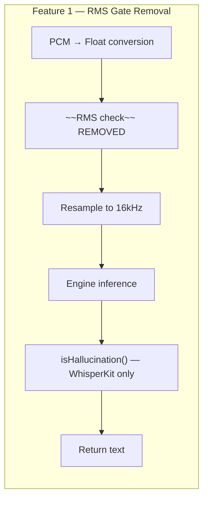

# TextEcho — Silence Skip Removal & Streaming Transcription Plan

**Audience:** Braxton (lead developer) and contributor Lochie  
**Purpose:** Research and implementation plan for two features — Issue #34 (RMS silence skip removal) and streaming transcription (partial real-time results)

---

## Feature 1: Remove Pre-Transcription RMS Silence Skip (Issue #34)

### Current State

Both `ParakeetTranscriber.swift` and `WhisperKitTranscriber.swift` apply an identical RMS check immediately after converting PCM audio to floats, before calling the inference engine:

```swift
private static let silenceRMSThreshold: Float = 0.005

let rms = computeRMS(floatSamples)
if rms < Self.silenceRMSThreshold {
    AppLogger.shared.info("Skipping transcription: audio too quiet (RMS=...)")
    return ""
}
```

The threshold (0.005 on a normalised [-1, 1] float scale) is roughly equivalent to audio that is nearly inaudible — about -46 dBFS. The code comment labels it a "hallucination filter".

### Why It Was Added

The RMS check is a coarse pre-filter against hallucination. Both Whisper and Parakeet can produce confident-sounding but fabricated text when fed silence or near-silence — Whisper famously outputs phrases like "Thank you for watching" on silent input. The check was a cheap line of defence that avoided invoking the Neural Engine at all on obviously-empty recordings.

### Internal Silence Handling in the SDKs

**WhisperKit:** Does not have its own silence gate before inference. It relies on callers to provide non-silent audio, or on VAD (Voice Activity Detection) layers sitting upstream. `AudioStreamTranscriber` (WhisperKit's own streaming class) uses an energy-based `silenceThreshold` parameter, but the `kit.transcribe(audioArray:)` call path used by TextEcho has no equivalent gate. WhisperKit's hallucination filter in `WhisperKitTranscriber` — the `isHallucination()` function checking known phrases and repetition — runs post-inference and is the real defence.

**FluidAudio/Parakeet:** `AsrManager.transcribe(_:source:)` does not apply its own RMS gate. Parakeet TDT is significantly less prone to hallucination than Whisper (its architecture produces empty output rather than fabricated text on silence), so the comment "less prone but still possible" in `ParakeetTranscriber.swift` is accurate but cautious. The threshold was copied across from the WhisperKit implementation for consistency.

### Risk of Removing It

| Risk                                                         | Severity | Mitigation                                                               |
| ------------------------------------------------------------ | -------- | ------------------------------------------------------------------------ |
| Whisper hallucinates on near-silent recordings               | Medium   | WhisperKit transcriber retains `isHallucination()` post-inference filter |
| Parakeet returns spurious tokens on near-silence             | Low      | Parakeet TDT emits no tokens on silence in practice                      |
| Wasted Neural Engine inference on empty recordings           | Low      | Inference is ~50–200ms; the UX cost of a spurious empty result is higher |
| Silent LLM mode recordings produce hallucinated input to LLM | Medium   | LLM path already checks for empty transcription before processing        |

The `isHallucination()` function in `WhisperKitTranscriber` already covers the hallucination case adequately — it checks known hallucination phrases and detects repetition loops. The RMS check adds little that `isHallucination()` does not cover, and it creates a user-facing failure mode: a recording that is genuinely quiet (whispered speech, soft voice, far-field mic) gets silently discarded with no feedback.

### Recommended Approach: Remove from Both Transcribers

Remove the RMS gate entirely from both `ParakeetTranscriber.swift` and `WhisperKitTranscriber.swift`. Do not make it configurable — the config surface is already large, and the tradeoff is clear. Post-inference filtering (the existing `isHallucination()` in WhisperKit, and empty-string detection in both paths) is sufficient.

Note: `AudioRecorder.swift` has a **separate** silence detection system (`checkSilence` / `silenceThreshold`) that governs auto-stop. This is unrelated to the transcription-level RMS gate and must **not** be touched.

### Files to Change

| File                          | Change                                                                                                                                                                               |
| ----------------------------- | ------------------------------------------------------------------------------------------------------------------------------------------------------------------------------------ |
| `ParakeetTranscriber.swift`   | Remove `silenceRMSThreshold` constant, `computeRMS()` call, and the RMS guard block (lines 91–95). Keep `computeRMS()` helper if it is used elsewhere — it is not, so remove it too. |
| `WhisperKitTranscriber.swift` | Remove `silenceRMSThreshold` constant, `computeRMS()` call, and the RMS guard block (lines 101–105). Keep `computeRMS()` helper — same as above, remove it.                          |

The `convertPCMToFloat()` and `resample()` helpers remain untouched. The `isHallucination()` function in `WhisperKitTranscriber` remains untouched.

### Complexity

**Low.** Four line-groups removed across two files. No protocol changes. No new dependencies. Risk is well-understood. Test by recording near-silence deliberately and verifying the overlay shows an appropriate empty result rather than silently vanishing.

---

## Feature 2: Streaming Transcription (Real-Time Partial Results)

### Current Flow

The recording → transcription → display pipeline is strictly sequential:

1. User triggers recording (`beginRecording`)
2. `AudioRecorder` buffers all PCM into `bufferData` in memory
3. User releases trigger or silence auto-stop fires (`endRecording`)
4. `recorder.stop { audioData in ... }` delivers the entire buffer at once
5. `transcribe(audioData:isLLM:)` calls the transcriber with the complete blob
6. Result is shown in `Overlay` and injected via `TextInjector`

There is zero partial output during recording. The overlay shows a scanner bar animation labelled "TRANSCRIBING" while the user waits.

### What Streaming Would Look Like

While the user is still speaking, text appears and updates in the overlay. When recording stops, the final cleaned-up transcript is used for injection. This is the "ghost text" or partial results pattern — familiar from macOS dictation and cloud ASR services.

### SDK Streaming Capabilities

**FluidAudio — real streaming architecture exists:**

FluidAudio ships a complete `StreamingAsrEngine` protocol and two implementations:

- `StreamingEouAsrManager` — Parakeet EOU 120M model (a separately-downloaded ~120M param model, distinct from the TDT model TextEcho currently uses). Chunk sizes: 160ms (lowest latency), 320ms, 1280ms. Provides `setPartialTranscriptCallback(_:)` which fires with accumulated partial text as each chunk is decoded. Also fires `setEouCallback(_:)` when end-of-utterance is detected. Requires separate model download (`FluidInference/parakeet-realtime-eou-120m-v1` CoreML models, distinct HuggingFace repo).

- `NemotronStreamingAsrManager` — Nemotron 0.6B streaming model. Higher accuracy, higher latency (560ms / 1120ms chunks). Not relevant for a dictation use case where low latency is the priority.

The EOU streaming model uses a **different CoreML model file set** from the TDT batch model. It requires its own download (~separate from the V2/V3 models already cached). The `StreamingAsrEngineFactory.create(.parakeetEou160ms)` call handles the instantiation; `loadModels()` or `loadModelsFromHuggingFace()` handles the download.

**WhisperKit — pseudo-streaming via `AudioStreamTranscriber`:**

WhisperKit ships `AudioStreamTranscriber`, which manages its own `AVAudioEngine` tap and re-transcribes a growing audio buffer at regular intervals. It returns `confirmedSegments` (stable) and `unconfirmedSegments` (may change). This is a sliding-window approach — not a true streaming encoder — so accuracy degrades on earlier segments as the window grows. It also takes over audio capture, which conflicts with TextEcho's existing `AudioRecorder`.

For the WhisperKit path, pseudo-streaming via `AudioStreamTranscriber` is feasible but complex to integrate (it owns its own audio tap). A simpler alternative is to skip streaming for the WhisperKit path entirely in a first implementation — WhisperKit is already the fallback engine, and its sliding-window approach introduces correctness tradeoffs.

### Architecture Change Required

Streaming fundamentally changes the pipeline. Instead of "record everything, then transcribe", the model needs audio while recording is happening. This requires three coordinated changes:

**1. Transcriber protocol extension**

The current `Transcriber` protocol only supports batch transcription:

```swift
protocol Transcriber: Sendable {
    func transcribe(audioData: Data, sampleRate: Double) async throws -> String
    ...
}
```

A streaming-capable protocol needs:

```swift
protocol Transcriber: Sendable {
    // Existing batch path (keep for WhisperKit and fallback)
    func transcribe(audioData: Data, sampleRate: Double) async throws -> String

    // Streaming path (optional — not all transcribers implement)
    var supportsStreaming: Bool { get }
    func beginStreaming() async throws
    func appendAudio(_ data: Data, sampleRate: Double) async throws
    func endStreaming() async throws -> String
    func setPartialCallback(_ callback: @escaping @Sendable (String) -> Void)
    ...
}
```

Alternatively, keep the existing protocol untouched and add a separate `StreamingTranscriber` protocol that `ParakeetTranscriber` optionally conforms to. This is cleaner — it avoids forcing `WhisperKitTranscriber` to stub streaming methods.

**2. ParakeetTranscriber — new streaming mode**

`ParakeetTranscriber` needs a second mode of operation: instead of creating an `AsrManager` for batch TDT transcription, it creates a `StreamingEouAsrManager` for streaming EOU transcription.

Key decisions:

- The streaming EOU model is a different model from TDT V2/V3. It needs a separate download, separate cache directory, and separate model lifecycle.
- The EOU model can be loaded in parallel with TDT or instead of it, depending on whether streaming mode replaces or supplements batch mode.
- `appendAudio` would receive audio chunks from `AudioRecorder` during recording (not just the final buffer) and forward them as `AVAudioPCMBuffer` to `StreamingEouAsrManager.appendAudio(_:)` + `processBufferedAudio()`.

**3. AudioRecorder — chunk callbacks during recording**

`AudioRecorder` currently accumulates all audio into `bufferData` and delivers it only on `stop()`. For streaming, it needs to also fire a callback on each buffered chunk (e.g. every 160–320ms) so chunks can be forwarded to the streaming engine concurrently.

```swift
var onAudioChunk: ((Data) -> Void)?  // new callback, fired during recording
```

The existing `bufferData` accumulation remains — it is still needed so the final transcript can be re-verified or used for injection.

**4. AppState — orchestrating the streaming session**

`AppState.beginRecording()` would need to:

- If using Parakeet streaming: call `beginStreaming()` on the transcriber
- Wire `recorder.onAudioChunk` → `transcriber.appendAudio()` during recording
- Update the overlay with partial text via a `partialCallback` → `overlay.showPartialResult(_:)`
- On `endRecording`, call `transcriber.endStreaming()` and use the returned final text for injection

`AppState.endRecording()` currently calls `recorder.stop { audioData in ... }` and dispatches transcription. In streaming mode, `endStreaming()` returns the accumulated final transcript rather than a post-hoc batch transcription.

**5. Overlay — partial result display state**

`Overlay` needs a new display state or needs to extend the existing `recording` state to show text accumulating in real time.

Option A: Add `.streamingPartial(text: String)` to `OverlayState` — clean separation.  
Option B: Reuse the `recording` state but allow `resultText` to be non-empty during recording — simpler but muddies the state model.

Option A is recommended. The overlay UI during streaming would show the waveform (retained) plus a growing text area below it. The "ghost text" should be visually distinct from the final confirmed result — lower opacity or a different colour signals "this may change".

### Implementation Phases

**Phase A — Infrastructure (no visible feature yet)**

- Add `StreamingTranscriber` protocol to `Transcriber.swift`
- Add `onAudioChunk` callback to `AudioRecorder`
- Add `.streamingPartial(text: String)` to `OverlayState` and `OverlayViewModel`

**Phase B — Parakeet streaming engine**

- Add streaming mode to `ParakeetTranscriber`: `StreamingEouAsrManager` lifecycle, `beginStreaming()` / `appendAudio()` / `endStreaming()`, partial callback wiring
- Add streaming model download to the settings UI (separate download from TDT models)

**Phase C — AppState wiring**

- Wire streaming path in `AppState.beginRecording()` and `endRecording()`
- Connect `onAudioChunk` → transcriber during streaming sessions

**Phase D — Overlay UI**

- Implement `streamingPartial` display state with ghost text styling
- Ensure smooth transition from streaming → confirmed result

### Files to Change

| File                        | Change                                                                                                                                             |
| --------------------------- | -------------------------------------------------------------------------------------------------------------------------------------------------- |
| `Transcriber.swift`         | Add `StreamingTranscriber` protocol with `beginStreaming`, `appendAudio`, `endStreaming`, `setPartialCallback`, `supportsStreaming`                |
| `ParakeetTranscriber.swift` | Add `StreamingTranscriber` conformance; add `StreamingEouAsrManager` lifecycle; implement chunk forwarding; manage EOU model download              |
| `AudioRecorder.swift`       | Add `onAudioChunk: ((Data) -> Void)?`; fire it from the audio tap callback                                                                         |
| `AppState.swift`            | Detect streaming capability; wire `onAudioChunk`; call streaming path in `beginRecording` / `endRecording`; route partial callbacks to overlay     |
| `Overlay.swift`             | Add `.streamingPartial(text: String)` to `OverlayState`; implement ghost text display; add `showStreamingPartial(_:)` to `OverlayWindowController` |
| `SettingsWindow.swift`      | Add streaming model download section (EOU model separate from TDT)                                                                                 |
| `AppConfig.swift`           | Add `streamingEnabled: Bool` config field (default `false` — opt-in until stable)                                                                  |

`WhisperKitTranscriber.swift` does not need changes in Phase 1 — WhisperKit falls back to the existing batch path.

### Risks and Tradeoffs

| Risk                                           | Severity   | Notes                                                                                                                                                                                                                              |
| ---------------------------------------------- | ---------- | ---------------------------------------------------------------------------------------------------------------------------------------------------------------------------------------------------------------------------------- |
| Separate EOU model download (~additional size) | Medium     | Users must download a second model set. Needs clear UI affordance. Ballpark: EOU 120M CoreML models are smaller than TDT V3 (~300–500MB estimated).                                                                                |
| EOU model accuracy vs TDT batch accuracy       | Medium     | EOU streaming is a different model (parakeet-realtime-eou-120m) tuned for streaming; TDT V3 has 2.1% WER. EOU accuracy not yet validated in TextEcho context — should be benchmarked.                                              |
| Actor isolation complexity                     | Medium     | `StreamingEouAsrManager` is an actor; `ParakeetTranscriber` is an actor; `AudioRecorder` callbacks are on AVAudioEngine's internal thread. Care needed to avoid deadlocks or priority inversion when passing chunks across actors. |
| Chunk delivery cadence vs `AVAudioEngine` tap  | Low-Medium | `AudioRecorder` currently uses `bufferSize: 1024` samples at 16kHz = ~64ms per tap callback. EOU prefers 160ms chunks. Accumulation logic needed to batch tap callbacks into 160ms chunks before forwarding.                       |
| Final text vs streaming text divergence        | Low        | The final `endStreaming()` result should be authoritative. If the final result differs materially from the last partial, the overlay will visibly update at paste time. This is acceptable UX.                                     |
| Config flag keeps it opt-in                    | Low        | `streamingEnabled` defaults to false. Existing users unaffected.                                                                                                                                                                   |

### Complexity

**High.** This is a multi-week feature involving a new SDK mode, a protocol change, a new audio pipeline callback, UI state additions, a new model download flow, and actor concurrency work. Phase A alone is a full session. Recommend sequencing: A → B → validate EOU accuracy → C → D.

---

## Summary Table

|                    | Feature 1: Silence Skip | Feature 2: Streaming                        |
| ------------------ | ----------------------- | ------------------------------------------- |
| Files changed      | 2                       | 7                                           |
| New dependencies   | None                    | FluidAudio EOU streaming (already in SDK)   |
| New model download | No                      | Yes — Parakeet EOU 120M (separate from TDT) |
| Protocol changes   | No                      | Yes — new `StreamingTranscriber` protocol   |
| Config changes     | No                      | Yes — `streamingEnabled` flag               |
| Complexity         | Low                     | High                                        |
| Risk               | Low                     | Medium                                      |
| Recommended order  | Do first                | Do second, phased                           |

---

## Mermaid: Current vs Streaming Pipeline

```mermaid
flowchart TD
    subgraph current["Current (Batch) Flow"]
        A1[User triggers recording] --> A2[AudioRecorder buffers all PCM]
        A2 --> A3[User stops / silence auto-stop]
        A3 --> A4[recorder.stop → full Data blob]
        A4 --> A5[transcribe audioData]
        A5 --> A6[Overlay shows result]
        A6 --> A7[TextInjector pastes]
    end

    subgraph streaming["Streaming Flow (Proposed)"]
        B1[User triggers recording] --> B2[AudioRecorder taps audio]
        B2 --> B3[onAudioChunk fires every ~160ms]
        B3 --> B4[StreamingEouAsrManager.appendAudio + processBufferedAudio]
        B4 --> B5[partialCallback fires]
        B5 --> B6[Overlay shows ghost text]
        B2 --> B7[bufferData still accumulates]
        B7 --> B8[User stops / silence auto-stop]
        B8 --> B9[endStreaming → final transcript]
        B9 --> B10[Overlay confirms final text]
        B10 --> B11[TextInjector pastes final]
    end
```




